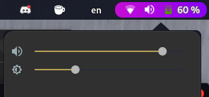
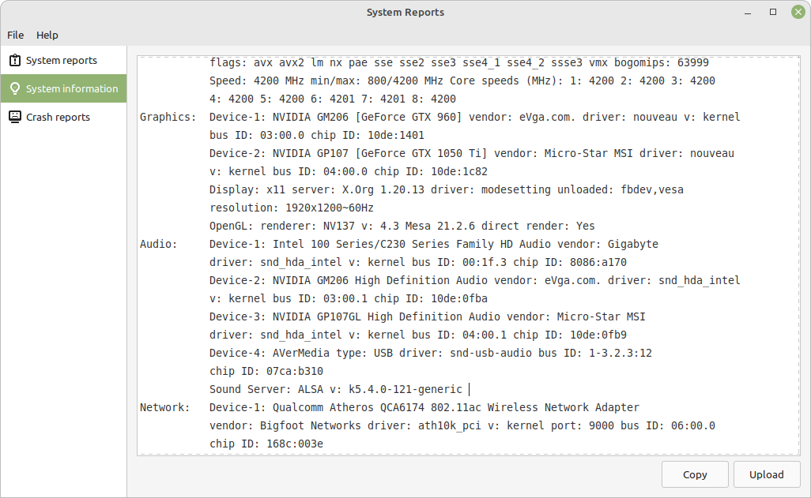

# Case 5833
## Case
Running Gigabyte z170x gaming g1 with creative ZxRi internal soundcard, no sound from speakers other than a constant hiss. I was told by friends to take the .bin files found in two reddit posts on the subject (specifically relating to the Core3D (CA0132) series audio devices) and drop them into the firmware directory, this did not solve the issue, the internal card does not show up under F6 in alsamixer.

## Chat log
[07:28] [BOT] Artemis: @Scholar, You have been summoned!
[07:28] [BOT] Artemis: @🖌✙「Mugën✦ 」 💾
[07:29] 🖌✙「Mugën✦ 」 💾: @Elana your case has been reopened
[07:38] Elana: So, is anyone able to help me?
[07:38] Elana: I see my messages here were also deleted, so I guess I'll need to reupload the info
[07:45] 🖌✙「Mugën✦ 」 💾: Artemis already pinged the scholars, now wait
[07:45] [BOT] Artemis: When? Quite honestly, I wouldn't worry myself about that. What is your favorite movie?
[07:46] 🖌✙「Mugën✦ 」 💾: Artemis, just go back to work
[07:46] [BOT] Artemis: I've never seen just go back to work. What did you like about it?
[07:46] 🖌✙「Mugën✦ 」 💾: Artemis is drunk.. oh well
[07:46] [BOT] Artemis: Some people think it is.    That's about it.
[09:08] Elana: here's the probe again: https://linux-hardware.org/?probe=3f04cb8ead
A database of all the hardware that works under linux
[09:08] Elana: going to bed now, I'll try to check in tommorrow, though I'm with family
[09:39] 🖌✙「Mugën✦ 」 💾: Bump
[14:49] Brackston: Newer kernel for latest drivers?
[19:30] 🖌✙「Mugën✦ 」 💾: @Elana
[19:54] Elana: latest kernal update already installed
[20:04] killertofu.sh: sudo apt update && sudo apt upgrade && sudo apt clean && sudo apt autoclean && sudo apt autoremove then reboot
[20:05] killertofu.sh: @Elana
[21:01] Elana: running commands now...
[21:02] Elana: terminal before reboot:

[21:04] killertofu.sh: did you reboot now?
[21:05] Cocogoat: @Elana dmesg | grep hda
[21:05] Cocogoat: And paste that here
[21:06] Elana: reboot complete, still no sound:

[21:07] Cocogoat: Also
[21:07] Cocogoat: It does seems your DSP is correctly initialized by the kernel
[21:08] Cocogoat: Notice how it detected one line out, 2 headphone outs and one mic input
[21:08] Elana: the only thing actually connected atm is line out
[21:09] Elana: advanced warning, I will be heading out soon, will follow any instructions given while away upon return
[21:10] Cocogoat: Gonna sleep soon so...
[21:10] Cocogoat: @Elana Run aplay -l 
[21:21] Elana:

[21:28] Cocogoat: @Elana Are you sure your output isn't muted?
[21:28] Cocogoat: There is your internal sound right there on top
[07:48] Elana: I'll check in the morning, not feeling good after getting home
[08:35] Elana: checked while awake briefly, the constant hiss is still all I get from the speakers. made sure everything was un-muted and did sound tests, no change
[09:42] Cocogoat: @Elana Try getting a wav file
[09:43] Cocogoat: Then you can play it using aplay
[19:18] Elana: I have plenty of wav files, I don't know how to designate a path in the terminal
[19:18] Cocogoat: @Elana You can just type aplay  and then drag a file into the terminal
[19:20] Elana:

[19:23] Elana: ok, I found out what I did wrong, still no sound:

[19:23] Cocogoat: @Elana Where did you get your firmware file?
[19:24] Elana: https://www.reddit.com/r/SoundBlasterOfficial/comments/9mm5ad/sound_blaster_r3dr3dizzxrae5_linux_driver/
reddit
r/SoundBlasterOfficial - Sound Blaster R3D/R3Di/Z/ZxR/AE-5 Linux Dr...
21 votes and 181 comments so far on Reddit
Image
[19:24] Elana: I've attempted both of the .bin files on this page
[19:26] Elana: btw, while I'm thinking about it, note that the card doesn't show up in alsamixer:

[19:30] Cocogoat: @Elana So the patch link you provided
[19:30] Cocogoat: It seems to be a patch for Linux which you have to apply manually
[19:31] Elana: I do not know how to do this
[19:31] Cocogoat: Though this should not be necessary as, this is only needed for 4.18
[19:32] Cocogoat: What firmware binary did you use?
[19:33] Cocogoat: Both?
19:33] Elana: All I did was drop both of the .bin files into the firmware directory
[19:33] Elana: I only did the r3di file after the other one failed to provide results
[19:35] Elana: to be clear, the version I have is the ZxRi
[19:35] Cocogoat: I mean technically there should already be one "usable" firmware file there
[19:36] Cocogoat: Check /lib/firmware to see if you also have a ctefx.bin
[19:36] Elana: it was already in there when I dropped the files in
[19:36] Cocogoat: It should
[19:37] Cocogoat: Try selecting your card here
[19:37] Elana: another look at my audio settings

[19:37] Cocogoat: Then press m
[19:37] Elana: it's not in the list
[19:38] Cocogoat: It's the Intel PCH one
[19:39] Elana: no change
[19:39] Cocogoat: @Elana Do you have a spare USB?
[19:39] Cocogoat: Try a newer distro like Fedora 36
[19:39] Cocogoat: See if sounds work there 
[19:40] Cocogoat: If it does we may have a way to get it working without too much modifications
[19:40] Cocogoat: If it doesn't, we'll have to see
[19:40] Cocogoat: You don't need to install Fedora, just boot it as a Live CD and test if sounds work
[19:42] Elana: a friend had suggested pop OS, would this be a viable option?
[19:42] unspoken: Si.
[19:43] Cocogoat: @Elana Not Pop. We want something like Fedora as it have fairly recent packages
[19:43] Cocogoat: Pop 22 may work
[19:43] Cocogoat: But we should get close to the latest Linux software first and work our way down
[19:44] Cocogoat: Since I suspect this isn't necessarily a driver issue (it could, but it was patched in 4.18), but might be a firmware thing 
[19:44] unspoken: Does audio work for you Elana in a live env?
[19:45] Elana: my audio has never worked using linux
[19:45] unspoken: Oh.
[19:45] Cocogoat: @Elana If it is Pop 22, you can try that
[19:46] Cocogoat: It does have a fairly new set of packages
[19:46] Cocogoat: Else, just reflash it with Fedora and go for that 
[19:46] unspoken:
aplay -l
[19:46] unspoken: What audio card do you have?
[19:46] Cocogoat: .
[19:46] Cocogoat: It does not play. What you can google off your head, I did that already.
[19:47] Elana: if you are going to participate, please read what has already been said so that things are not unnecessarily repeated.
[19:48] unspoken: Scrolled up but didn't see the ss, my bad.
[19:49] Elana: some of my friends had a bad experience with redhat, is there anything debian based that would meet our needs?
[19:49] Cocogoat: I mean we're not installing it, so that does not really matter
[19:50] Cocogoat: Yes RedHat-based distros does have some pain
[19:50] Cocogoat: But we are not going to install that on your machine, we're just going to check if stuff work in a live session
[19:50] unspoken: Wouldn't arch have the most recent packages over fedora?
[19:51] unspoken: By arch, I am including arch based. (So chill out, no one is going to be installing arch) 
[19:51] Cocogoat: @unspoken Technically yes, but I would probably prefer Fedora in this case 
[19:51] Cocogoat: Since it is closer to upstream
[19:52] Cocogoat: Manjaro, eh, maybe their nightlies?
And Endeavour usually have LTS on their install media
[19:52] unspoken: They do.
[19:52] unspoken: Wdym?
[19:52] Cocogoat: @unspoken I think you know how Fedora maintainers don't usually tinker too hard with stuff in their distro? 
[19:53] unspoken: Yeah.
[19:53] unspoken: But I hate fedora mainly because of dnf.
[19:53] Cocogoat: I know
[19:53] Cocogoat: I don't use it.
[19:53] Cocogoat: I run Arch
But if I need to test a machine with latest Linux packages, I will rely on Fedora 
[19:53] unspoken: 👍
[19:54] unspoken: I'll leave you guys be, I can't help anyways.
[19:54] Elana: I specifically looked at mint again because supposedly they got my hardware working on ubuntu, and sense mint is a fork of ubuntu....
[19:54] Cocogoat: @Elana I mean yes, probably a lot of issues would be resolved with Mint 21 
[19:55] Cocogoat: As it moves to a newer base
[19:55] unspoken: That doesn't nessarily mean that what they do to ubuntu will be done to mint. 
[19:56] Cocogoat: Well yes, but generally it would transfer well to Mint 
[19:56] Cocogoat: @Elana I think you know how to get Fedora?
[19:56] Elana: downloading ISO now
[19:56] Cocogoat: If it works
[19:57] Cocogoat: I may be able to get something working within Mint 
[20:00] Elana: Not promising anything
[20:01] Elana: btw, I know it doesn't matter, but the first time I attempted this was on 18.2
[20:01] Cocogoat: @Elana That will definitely not work
[20:01] Cocogoat: Since 18.2 is much older
[20:01] Elana: at the time, 18.2 was the current version
[20:03] Cocogoat: Yeah but even 19.3 was basically 4.15
[20:03] Cocogoat: Way too old
[20:03] Elana: I built my system in 2016, and I actually attempted to use linux before encountering this issue and moving back to windows after failing to find a solution.
[20:04] unspoken: Mint 17.3 with xfce is based. 
[20:05] Elana: ok, iso has been written, will have contact here from phone, but responses will be slow
[20:05] Cocogoat: @Elana When you boot, there will be something asking you to "Test the media" 
[20:05] Cocogoat: Skip that, just boot. Checking will take you forever 
[20:06] 🖌✙「Mugën✦ 」 💾: Just a comment about this: you can use ventoy to have several ISOs to boot into so you can test your audio hardware.
[20:06] 🖌✙「Mugën✦ 」 💾: So you can have fedora, mint edge iso, EndeavourOS and so on. Useful for this case
[20:07] Elana: no idea what ventoy is
[20:08] unspoken: It's like rufus.
[20:08] 🖌✙「Mugën✦ 」 💾: https://www.ventoy.net/
Ventoy
[20:08] unspoken:
Ventoy is an open source tool to create bootable USB drive for ISO/WIM/IMG/VHD(x)/EFI files.
[20:08] 🖌✙「Mugën✦ 」 💾: It's a multiboot solution
[20:08] 🖌✙「Mugën✦ 」 💾: Now I'll let cocogoat lead this case.

20:11] Elana: Same hiss under fedora live session
[20:12] Cocogoat: @Elana Nothing from either the front or back outputs?
[20:12] 🖌✙「Mugën✦ 」 💾: Send shots and logs for cocogoat
[20:12] Elana: And I'm not familiar with fedora's ui
[20:13] 🖌✙「Mugën✦ 」 💾: Depends of which version you are using. Workstation ships with gnome but you can use fedora cinnamon 
[20:13] Cocogoat: @Elana Click "Activities" on the top left of the desktop
[20:13] Cocogoat: Then choose the grid like icon
[20:13] Cocogoat: That will open a list of apps
[20:13] Cocogoat: Look for "System Settings"
[20:14] Cocogoat: You should be able to find "Sounds" there
[20:14] Elana: Analog output test failed
[20:15] Cocogoat: Does it literally says that in the UI? 
[20:16] Elana: I select the option that is not my microphone and no sound comes out
[20:18] Elana: Just repeated the test with headphones, same result, though the system did detect that the headphones were plugged in
[20:19] Elana: The hiss is all I get from headphones and speakers
[20:19] Cocogoat: So when you click the Test button and choose a side, nothing happens? 
[20:19] Elana: Nothing
[20:20] Cocogoat: Even when you click on Front Left and Front Right?
[20:20] Elana: Infact, balance is greyed out
[20:20] Cocogoat: Hmm...
[20:20] Elana: Yup
[20:21] Cocogoat: Does it says something like "Speakers" or "Line Out" here?
[20:21] Cocogoat: \

[20:22] Elana:

[20:22] Elana: That is the same list that showed up in mint btw
[20:22] Elana: No changes there
[20:22] Cocogoat: Yeah, so it detects the correct outputs on the card 
[20:23] Cocogoat: So the last two outputs nothing?
[20:23] Elana: I do not have any s/pdif equipment to test with 
[20:24] Elana: Correct
[20:24] Cocogoat: So, open the Applications menu again
[20:25] Cocogoat: And look for the Terminal
[20:25] Cocogoat: After clicking Activities you can just type 'Terminal' to look for it
[20:25] Elana: Up
[20:26] Cocogoat: Type in dmesg | nc termbin 9999
[20:26] Cocogoat: And then send the last characters of the URL it gives
[20:27] Elana: Is a net connection needed for this?
[20:27] Cocogoat: You do.
[20:27] Cocogoat: You can connect to a network by clicking up here
[20:27] Cocogoat:

[20:28] Cocogoat: You should see your Wi-Fi connection. Click on it, then select "Select Networks"
[20:29] Cocogoat: After that, run the command and send the outputs. Then you can turn your computer off and start back into Mint 
[20:29] Elana: It says im connected to the network but the terminal command suggests that it cannot reach the destination 
[20:30] Cocogoat: You will need to wait a bit
[20:30] Cocogoat: If it hangs, just close the terminal and open it again
[20:32] Cocogoat: @Elana Oh lol whoops
[20:32] Cocogoat: dmesg | nc termbin.com 9999
[20:32] Cocogoat: No wonder
[20:32] Cocogoat: My bad
[20:33] Elana: Https://termbin.com/xdc3
[20:34] Cocogoat: Okay now to get your system out of Fedora, click the top right menu
[20:34] Cocogoat: Choose Power Off/Log out
[20:34] Cocogoat: Then Power Off
[20:34] Elana: Done
[20:36] Cocogoat: @Elana Back to Mint?
[20:37] Cocogoat: Now extract and dump all of these files into your /lib/firmware and reboot 
Attachment file type: archive
firmware.7z
113.99 KB
[20:47] Elana: How do I get perms in the UI to rename the old files? I just want to add a .bak to the end so they aren't overwritten....just incase
[20:48] Cocogoat: Open a terminal and run pkexec nemo
[20:52] Elana: files renamed and copied
[20:56] Cocogoat: Now reboot and see if anything changes
[20:58] Elana: none that I can see (or hear)
[21:03] 🖌✙「Mugën✦ 」 💾: @Cocogoat :thiss:
[21:04] Cocogoat: @Elana Check Sounds settings and make sure it’s on the proper device (Line out or Headphones)
[21:16] Elana: Only change I can come up with from previous tests is that under conditions that I haven't quite been able to pin down, something about the audio test for the headphones will occasionally replace the hiss with dead silence
[21:17] Elana: this has not been the case for the speakers
[21:18] Cocogoat: @Elana Headbanging right now. Found it.
[21:19] Cocogoat: Your board doesn’t work with the given firmware which provides DSP features
[21:19] Cocogoat: It only works when it runs a “generic” build 
[21:20] Elana: so, what does that mean for us?
[21:20] Cocogoat: Even though the codec is detected, this thing won’t “just work”
[21:20] Cocogoat: https://bugzilla.kernel.org/show_bug.cgi?id=111021
[21:24] Elana: No idea if this is relevant, but under windows the board has it's own UI made by creative, which autodetects if a device is plugged in and has the user doublecheck that it's the correct device type, plugged into the correct port (it will auto select what is supposed to be there from a dropdown list and ask for confirmation), this is also the prefered method of doing the soundtest with this setup.
[21:25] Cocogoat: Try this
[21:25] Cocogoat: Open alsamixer
[21:25] Cocogoat: Choose your card (Intel PCH)
[21:25] Cocogoat: Hit m to disable autoselect
[21:26] Cocogoat: Then post a screenshot
[21:26] Elana: huh, the order changed, this is the first difference I've seen sense the firmware dump:

[21:26] Elana: the mic used to be above the nvidia options
[21:27] Elana: no change from the screen I just gave and pressing m
[21:28] Cocogoat: Now move to Surround
[21:28] Cocogoat: And pull it up
[21:29] Elana: can't, also no bar
[21:30] Cocogoat: I’ll have to look at it tomorrow
[21:30] Cocogoat: Not sure if it’s still a kernel or just config bug at this point
[21:31] Elana: it might be worth noting that the link you referenced, the newest post is from 08/2016, the reddit threads I looked at are at most 4 years old, which would be 2018
[21:32] Elana: the newer thread that references the thread with the .bin files I tried is from 2020
[03:52] Cocogoat: @Elana then again your mobo isn’t exactly a new one either
[11:40] Elana: which is why I wish this problem wasn't so difficult....also, about to go to bed for the night 
[19:18] Elana: so, do we have any more steps we can try?
[19:38] Elana: Decided to test pop OS, hoping for a different result for sound.....I'm doing everything I can to get this working before considering getting a dedicated sound card.
[20:03] Elana: Back from my test, no luck on sound.
[20:12] Elana: @Cocogoat a new piece of information regarding the issue, I just thought to try muting/unmuting via the keyboard button, even when the comp is supposedly muted, the hiss is still present.
[20:15] Cocogoat: That is to be expected
[20:15] Cocogoat: The buttons are handled by the software
[20:17] Elana: I was hoping it would atleast stop the hiss
[20:17] Cocogoat: @Elana https://bbs.archlinux.org/viewtopic.php?id=268429
[20:17] Cocogoat: I mean
[20:17] Cocogoat: Here is a 2021 post
[20:19] Elana: this post references the reddit stuff I had already found, and there are no replies, this is discouraging.
[20:20] Cocogoat: Yeah
[20:20] Cocogoat: You know what is the funny thing though
[20:20] Cocogoat: ...the patch doesn't even have that quirk line
[20:22] Cocogoat: @Elana Do you still have a Windows partition?
[20:22] Elana: no, that went byebye when the drive containing 10 failed
[20:27] Cocogoat: @Elana sudo apt install alsa-tools-gui
[20:27] Cocogoat: Launch the hdajackretask app after 
[20:30] Elana:

[20:31] Cocogoat: Override the one you’re using for sound output
[20:32] Cocogoat: @Elana
[20:33] Elana: tried doing a blanket override hoping atleast one would give a result, this is what I got in response:

[20:34] Cocogoat: You may need to run it as root
[20:35] Elana: so, put sudo before the app name?
[20:35] Cocogoat: Yeah
[20:35] Elana: same error
[20:37] Cocogoat: Don’t try ticking all of them
[20:37] Cocogoat: Try with one port first
[20:38] Cocogoat: @Elana
[20:40] Elana: I get the error even with just one ticked

[20:48] Cocogoat: You can guess it by looking at the GUI
[20:48] Cocogoat: If you want to make it easy
[20:48] Cocogoat: Plug something into the rear port
[20:48] Cocogoat: And override just that
[20:49] Elana: my primary speakers are already plugged in through the back
[20:50] Elana: jack options for the back:
[20:51] Elana:

[20:51] Cocogoat: That would be the Green or Grey line out
[20:52] Elana: I actually never realized that the labels were back lit before xD
[20:53] Cocogoat: @Elana oh lol
[20:53] Cocogoat: I’m dumb
[20:53] Cocogoat: sudo hda-jack-sense-test -c 1 -d 1 -a
[20:53] Cocogoat: You can just run that and it tells you what’s plugged in
[20:54] Elana: hda-jack-sense-test: command not found
[20:56] Cocogoat: sudo hdajacksensetest
[20:56] Cocogoat: Maybe?
[20:57] Elana: command not found
[20:58] Cocogoat: Then I guess just change both in hda jack retask
[21:00] Elana: I have tried assigning both green and grey jacks to front, nothing changed
[21:00] Cocogoat: You need to restart Pulse
[21:00] Cocogoat: Then you can play audio
[21:01] Elana: the result I gave included the restart
[21:01] Cocogoat: Then just step through the options one by one
[21:01] Elana: I thought you said not to
[21:02] Cocogoat: What I mean is that there should be a few options to retask
[21:02] Cocogoat: Try each
[21:03] Cocogoat: Also
[21:03] Cocogoat: @Elana Are you sure you can’t run sudo hdajacksensetest?
[21:03] Elana:

[21:04] Cocogoat: Try sudo apt install alsa-tools
[21:04] Elana: that worked:

[21:05] Cocogoat: Uhm…
[21:05] Cocogoat: I don’t think it would send sound to the back if you have something on front 
[21:05] Cocogoat: So try that
[21:05] Elana: please rephrase
[21:06] Elana: with headphones unplugged:

[21:06] Cocogoat: Basically you have your headphones plugged into the green port on the front of the case, correct?
[21:06] Cocogoat: Yeah, some boards may not send sound to the back port if that’s connected
[21:06] Cocogoat: Okay
[21:06] Cocogoat: Now just override that green line and see what happens
[21:07] Elana: my board is supposed to be able to switch between front and back
[21:07] Cocogoat: Yeah but is it through software?
[21:07] Elana: probably
[21:07] Cocogoat: Just test with one connected now
[21:08] Elana: though the sound window showed both independently
[21:08] Cocogoat: We’ll deal with that later
[21:08] Elana: what do I override it with?
[21:09] Cocogoat: Just… bruteforce
[21:09] Cocogoat: Try every one of them
[21:09] Elana: ....I wish I could share screenshots in this with dropdowns extended
[21:10] Cocogoat: You can press Ctrl + Alt + PrnScr
[21:10] Cocogoat: And it will copy a screenshot of the current window to your clipboard
[21:11] Elana: tried it, nothing happened
[21:12] Cocogoat: Does Ctrl + Shift + PrnScr works?
[21:12] Elana: nope
[21:13] Cocogoat: What’s there then?
[21:13] Cocogoat: Line out, spdif and such?
[21:14] Elana: line out
*front
*center/lfe
*back
*side
internal speaker
internal speaker (lfe)
internal speaker (back)
dock line out
[21:19] Elana: all options failed
[22:25] Elana: @Cocogoat given that I'm reading posts from 2020 that claim the ZxR PCIe card works as a plug-n-play device, how likely is it that this issue we're having is specific to the fact what I have is technically onboard audio?
[22:28] Elana: https://www.linuxquestions.org/questions/linux-hardware-18/linux-soundcard-experience-4175684893/#post6183417
Linux Soundcard experience
[06:18] Elana: @Cocogoat about to head to bed, while you were away I did some research on replacement soundcards as an alternative to sticking with onboard audio, the most economical option I could find for my needs cost nearly 240USD
[06:48] Cocogoat: @Elana I mean you can just buy any good ol USB interface 
[18:35] Elana: USB ports are at a premium on my system, despite the number I have at my disposal
[18:50] Elana: @Cocogoat do we have anything else we can try before we abandon trying to get my onboard audio to work?
[19:19] Cocogoat: I mean if you want to like, patch and build your own kernel
[19:19] Cocogoat: Then maybe it can work
[19:53] Elana: I don't have the technical knowhow
[20:18] Elana: @Cocogoat does this mean that finding a replacement audio source is now the only step we can take then?
[20:37] Cocogoat: @Elana Probably the simplest
[20:37] Cocogoat: If it was my motherboard then I would probably tinker with it
[20:37] Cocogoat: But not having the hardware here is a bit of an issue
[20:51] Elana: In that case, instead of closing the ticket and opening another, I would like to refocus our efforts on finding a new device to replace the onboard audio. 

My first choice is a PCIe card, but I might be open to USB options, provided that my port numbers are somehow expanded beyond their current state, as the rear IO panel is almost full. I do not know if I can get full functionality out of it in linux, but my mobo is equipped with a single thunderbolt 3 USB-C port that has been in reserve sense I got it with the possibility of using it with devices intended to use that protocol. A solution that takes advantage of this might be doable. 
[21:23] Elana: Having hookups for 5.1, a replacement or a header for front IO audio, and decent audio quality are required. 
[22:23] Elana: I have located a used soundblaster ZxR, both in an attempt to make use of the work done, and to fulfill the system's design to include one of these, I'm going to make the attempt to add it, using the drivers we've already implemented. I will have a 5 day return window if this does not work out.
[22:25] Elana: To be clear, I am trying this because according to posts dated to 2018, this should work, even if the onboard version does not.
[03:51] Cocogoat: I mean the device is supported under Linux
[03:51] Cocogoat: The problem here is that Gigabyte customized the pin layout
[03:51] Cocogoat: And who knows what happened
[04:14] Cocogoat: If I can borrow a build server today I'll try to compile you a kernel
[04:33] Cocogoat: Apparently I read some more updated posts and it's a fairly simple kernel patch
[07:01] Elana: I've already paid for the card, I'm just waiting for it to ship to my local store, I bought it after you said it was the simplest solution
[07:34] Cocogoat: Yeah, it is the simplest, because you will get the most standard implementation
[07:34] Cocogoat: So it would just work with not much tinkering
[07:35] Cocogoat: But I'll look into that other one as well
[07:35] Cocogoat: Also, note
[07:35] Cocogoat: Your board audio is a SoundBlaster ZxRi which is actually not supported even in that post
[07:36] Cocogoat:

[07:37] Cocogoat: See?
[07:38] Cocogoat: The ZxRi has a different DAC mapping, so the driver (which without proper support, assumes R3Di) won't work 
[07:50] Elana: I had identified the ZxRi when I was first addressing the problem, and some of the reddit posts did mention it, one specifically mentioned it being used on certain gigabyte motherboards, mine being an example of this.
[07:52] Elana: second from the bottom on the card listing, above the AE-5: https://www.reddit.com/r/SoundBlasterOfficial/comments/i84832/creative_sound_core_3d_ca0132_r3dr3dizzxrzxriae5/
reddit
r/SoundBlasterOfficial - Creative Sound Core 3D (CA0132) R3D/R3Di/Z...
12 votes and 32 comments so far on Reddit
[07:53] Elana: Shutting down for the night to keep the room cool
[07:55] Cocogoat: Yeah although it would be funny if the patch is actually two years old and not merged into mainline
[00:25] Elana: any guesses as to what the timeframe is for this sort of thing?
[01:51] Elana: ETA is a week from yesterday
[20:30] Elana: Given that I'm not the only one to have the issue that made this ticket, are you still planning on making a kernal patch to address it?
[20:35] Cocogoat: Yeah, working on it
[20:35] Cocogoat: I finally got enough energy at night to do a kernel patch
[20:36] Cocogoat: XD
[20:36] Elana: it would be good to have the patch on hand, even if I use a separate sound card, onboard as a backup is always a good idea imo
[20:37] Cocogoat: Apparently from what I read

[20:37] Cocogoat: The ZxRi is like a Recon3Di but with different DAC mappings
[20:39] Elana: good to know, though it doesn't personally do me any good to be aware of this beyond being able to reference it.
[21:17] Cocogoat: @Elana this is fun by the way, have I mentioned?

[21:17] Cocogoat: 8 core at max load
[21:31] Elana: I cannot tell if you're being sarcastic or not, if you aren't, I still lack the skill to have this kind of fun
[21:32] Cocogoat: No, really, hacking things like this and see it works in front of you is cool
[21:42] Cocogoat: @Elana https://wormhole.app/6Njzq#PykPPKwD0HwNTAxD9U846g
Wormhole
Wormhole - Simple, private file sharing
Wormhole lets you share files with end-to-end encryption and a link that automatically expires.
Wormhole - Simple, private file sharing
[21:42] Cocogoat: Try this
[21:43] Cocogoat: Extract, open a terminal in the folder and sudo dpkg -i linux*5.4.0-121*.deb
[21:53] Cocogoat: Then reboot and choose the new unsigned kernel
[03:12] Elana: will try before bed
[03:55] Elana: ok, let's see how this goes
[04:06] Elana: @Cocogoat encountered errors after submitting the terminal command: 
[04:34] Elana:
oem@Elana-PC:~/Downloads/linux$ sudo dpkg -i linux*5.4.0-121*.deb
[sudo] password for oem:         
Selecting previously unselected package linux-buildinfo-5.4.0-121-generic.
(Reading database ... 313849 files and directories currently installed.)
Preparing to unpack linux-buildinfo-5.4.0-121-generic_5.4.0-121.137_amd64.deb ...
Unpacking linux-buildinfo-5.4.0-121-generic (5.4.0-121.137) ...
Expand
message.txt
6 KB
[06:35] Cocogoat: @Elana Dependency problems
[06:35] Cocogoat: Install the tools package separately
[06:35] Elana: instructions please
[06:40] Cocogoat: @Elana sudo dpkg -i linux-tools-5.4.0-121.deb
[06:40] Cocogoat: Then you can install those other ones again
[06:41] Elana:

[06:42] Cocogoat: Then just try sudo apt-get install -f
[06:42] Cocogoat: And see if it figures it out
[06:43] Elana: the terminal seems to have stalled:

[06:45] Elana: it finished, I ran the previous command again, same error:

[06:45] Cocogoat: You don’t need to
[06:45] Cocogoat: It is set up
[06:45] Elana: so then restart?
[06:45] Cocogoat: You may also want to make GRUB not hidden
[06:47] Cocogoat: xed admin:///etc/default/grub and comment out GRUB_TIMEOUT_STYLE=hidden 
[06:47] Cocogoat: Then sudo update-grub
[06:47] Cocogoat: This will make it less painful to switch to an older kernel if the build fail
[06:47] Cocogoat: @Elana
[06:48] Elana: this command resulted in this:

[06:49] Elana: and

[06:49] Cocogoat: Yeah in the editor
[06:49] Cocogoat: Just put a # in front of GRUB_TIMEOUT_STYLE
[06:49] Cocogoat: Then save, close and update GRUB
[06:51] Elana:

[06:52] Cocogoat: Now reboot
[06:52] Cocogoat: Cross your fingers I didn’t f-ed up anything
[06:56] Elana: unless I missed something, the comp just rebooted to the desktop, no kernal selection
[06:57] Cocogoat: @Elana After you comment out the Timeout style
[06:57] Elana: ooh, this is different, no hiss now 
[06:57] Cocogoat: You should see a new menu on boot
[06:57] Cocogoat: That allows you to select advanced options
[06:57] Cocogoat: This will allow you to access older kernels
[06:59] Cocogoat: I mean no hiss
[06:59] Cocogoat: But like
[06:59] Cocogoat: What works
[06:59] Cocogoat: That’s the real question 😂
[06:59] Elana: still nothing, the lack of hiss seems to be the only change
[06:59] Cocogoat: Check the back line out port
[07:00] Elana: I did this, and just checked, it still has the #
[07:00] Elana: that didn't seem to change startup
[07:00] Cocogoat: Seems like so far that’s the only one that have the best chance of working
[07:03] Elana: this also changed, still no sound though:

[07:04] Elana: I have youtube playing in the background as a test
[07:04] Cocogoat: Check other ports
[07:04] Cocogoat: See if anyone have some kind of output
[07:07] Elana: nothing
[07:08] Cocogoat: @Elana Also, lol
[07:08] Cocogoat: Someone mentioned
[07:09] Cocogoat: They pass the audio part to a Windows VM and it works there
[07:09] Cocogoat: Like, what sort of messed up chip is this
[07:09] Elana: I would kindof expect it to work there, the official drivers are for windows...
[07:10] Elana: the grub timeout comment doesn't seem to do anything btw
[07:11] Cocogoat: Can you show me your config file again
[07:15] Elana:

[07:17] Elana: on a (mostly) unrelated note, I just clicked on the first inoffensive looking vid and hit play, so that if we get sound, I'll hear it immediately, the vid is made by some channel called "world of idiots"
[07:31] Cocogoat: @Elana Check dmesg
[07:31] Cocogoat: See if there is any ca0132 warnings
[07:32] Elana: instructions
[07:32] Cocogoat: dmesg | grep ca0132
[07:34] Elana:

[07:35] Cocogoat: Check hdajackretask 
[07:36] Elana:

[07:40] Cocogoat: https://www.linuxquestions.org/questions/linux-newbie-8/no-audio-in-front-or-rear-jack-hdmi-audio-working-ubuntu-18-04-a-4175645687/#post6144400
No Audio in front or rear jack - HDMI Audio working - Ubuntu 18.04
[07:40] Cocogoat: Headbanging rn
[07:40] Cocogoat: You can try using that digital SPDIF
[07:40] Cocogoat: But no idea if any other ports is gonna work 
[07:40] Cocogoat: Since the patch was for 4.18
[07:41] Cocogoat: And the kernel has changed quite a bit since
[07:42] Cocogoat: Almost funny how macOS on this board have better support
[07:43] Elana: why does it give yellow and purple for spdif? I only have one
[07:44] Elana: and I've never seen those color coded
[07:45] Cocogoat: @Elana Yellow and purple?
[07:47] Elana: second and third entry, as for blue, I don't even have one spdif in
[07:47] Cocogoat: That is normal.
[07:47] Cocogoat: SPDIF is an output-only port and it is digital
[07:48] Cocogoat: So it is always active
[07:50] Cocogoat: @Elana I think what happens is that we managed to set the correct sound chip for it to assume (Recon3Di)
[07:50] Cocogoat: Thus the hiss is gone since the DSP was able to process some command
[07:50] Cocogoat: But because it is not a 3Di other stuff failed spectacularly
[07:52] Cocogoat: You know what
[07:52] Cocogoat: I'll make a really dirty patch
[07:52] Cocogoat: And just override the R3Di's ports with the ZxRi one
[07:56] Elana: The only ports I'm aware of are:
Rear IO, left to right, top to bottom
*mic
*c/sub
*out
*rear
*SPDIF out
*headphones

Front IO
*mic
*headphones
[07:56] Cocogoat: No, not that
[07:56] Cocogoat: Think of it like this
[07:56] Cocogoat: The sound chip has areas it can access
[07:56] Cocogoat: And it does that via addresses
[07:57] Cocogoat: And Creative changed the ZxRi’s addresses compared to R3Di
[07:59] Cocogoat: It’s low level electronic crap
[08:35] Cocogoat: https://wormhole.app/vE3mk#UMoJnaNaIXN1AwBn7RCCFA
Wormhole
Wormhole - Simple, private file sharing
Wormhole lets you share files with end-to-end encryption and a link that automatically expires.
Wormhole - Simple, private file sharing
[08:35] Cocogoat: @Elana Try this kernel
[08:38] Elana: run this again, or something else?
[08:40] Cocogoat: Yeah
[08:40] Cocogoat: I mean at this point
[08:40] Cocogoat: Your sound of success would be the one Mint makes when it starts up
[08:40] Cocogoat: XD
[08:41] Cocogoat: just like this one
https://www.youtube.com/watch?v=zLDlWNDmR8k
YouTube
funnybone
The Homebrew Channel - Full Theme
[08:42] Elana: gives a reminder that she is still deaf
[08:43] Elana: also:

[08:43] Elana: I put it in a separate folder to avoid complications
[08:44] Elana:

[08:44] Cocogoat: Extract until you get the deb files 
[08:44] Cocogoat: tar.xz is two layers
[08:44] Elana: it wouldn't let me extract the tar file
[08:44] Cocogoat: What...
[08:44] Cocogoat: Alright one moment
[08:44] Elana: ....ok, now that I complain about it
[08:45] Elana: before it gave me an error
[08:46] Elana: hey, it's doing stuff this time
[08:46] Cocogoat: Stuff?
[08:46] Elana:

[08:46] Cocogoat: Wait hold on
[08:47] Elana:

[08:48] Cocogoat: sudo apt remove linux-image-unsigned-5.4.0-121-generic_5.4.0-121.137_amd64.deb 
[08:49] Elana:

[08:49] Cocogoat: Basically remove that last line
[08:49] Cocogoat: @Elana Actually
[08:49] Cocogoat: sudo apt remove linux-image-unsigned-5.4.0-121-generic
[08:49] Elana: can't stay up much longer, getting sleepy
[08:49] Cocogoat: That will get rid of the old build
[08:49] Cocogoat: Then install the new one over
[08:50] Elana:

[08:51] Elana:

[08:51] Cocogoat: Reboot
[08:53] Elana: I got one pop from the speakers, then nothing, and now I'm only getting SPDIF out again
[08:54] Cocogoat: Wait
[08:54] Cocogoat: Try playing something now
[08:55] Elana: youtube test failed
[08:55] Cocogoat: Ahh f***
[08:55] Cocogoat: I thought that sound was the card trying to play something
[08:55] Cocogoat: Some sound cards does that 
[08:58] Elana: I'll deal with it more tomorrow
[18:22] Elana: So, anything else we can try?
[05:31] Elana: @Cocogoat ☝️
[05:38] Cocogoat: @Elana I'm still thinking where the missing pieces might be
[05:39] Cocogoat: Try hdajackretask everything on the off chance that one works
[05:41] Elana: I forget the process for doing this
[06:27] Elana: @Cocogoat please work with me, fighting a headache tonight, processing ability is limited
[07:42] Cocogoat: I’m still thinking of anything that could have went wrong here
[07:42] Cocogoat: Maybe later.
[14:38] Brackston: hdajackretask reassigns (overrides) the default  connections. I have used it with newer systems to correct the audio pathways.
[14:39] Brackston: In Linux Mint there is a Kernel installation and removal tool as part of the the Update Manager, if interested in using that @Elana.
[15:40] Cocogoat: We've tried it
[15:40] Cocogoat: The problem is that there is no Linux support at all for this card
[15:41] Cocogoat: I tried to jerry rig the drivers from a similar-enough card but it doesn't appear to work
[15:52] Brackston: Thanks Cocogoat.  I guess she will just have to wait. 
[15:52] 
BOT
 Artemis: @Brackston gifted Buzzle ¥25!
[15:54] Cocogoat: @Brackston The guy who made the drivers for the other CA0132 cards already... kinda quits
[15:54] Cocogoat: So...
[15:54] Cocogoat: Also, she
[15:54] Cocogoat: I'm not picky but some can be kind of sensitive to it so...
[22:19] Elana: is trans and is sensitive about being misgendered
[22:29] Brackston: Science can resolve your issue. 
[22:30] Brackston: Hopefully you will find a driver for your sound soon,
[00:23] Elana: isn't sure which issue this is in reference to 
[08:14] Elana: I honestly can't remember if we tried everything using this approach
[09:17] Cocogoat: We did
[09:18] Cocogoat: Those kernels I send have them baked in
[17:48] Elana: I seem to recall there was something you wanted me to try, but I couldn't remember how to do it exactly
[17:59] Brackston: It looks like the modified kernel did not install since the same version (although unmodified) was already installed. here is what you need to do:
1. Reboot into  grub and choose the Advanced options, choose a lower version kernel, and boot that.
2. Once at the desktop, open Update Manger and select "view" and then "Linux Kernels"
3. Click continue.
4  Select the Kernel you are trying to replace (version 5.4.0-121)
5. remove that kernel
6. Reboot
7 Follow the instructions to install the modified version Cocogoat sent to you.
8. Reboot to grub, pick advanced options and select the newly install kernel. 
[18:00] Elana: @Cocogoat when I was first setting up my comp in 2016, before I discovered the sound problem, I was toying with the idea of eventually using arch if I could wrap my head around the setup process, knowing that the driver we've been trying was written for ubuntu, would I be correct in guessing it wouldn't be compatible?
[18:01] Brackston: drivers are pretty much agnostic.
[18:01] Elana: I thought that only applied for distros based on debian
[18:02] Elana: we have been unable to get my system to reboot into grub, the instructions I followed before did not alter how the OS boots
[18:03] Brackston: It also showed that the install failed.
[18:03] Brackston: can you boot into the desktop?
[18:03] Elana: I'm in it now
[18:03] Brackston: If you can you can modify grub to allow you to access it.
[18:03] Brackston: Ok 1 sec.
[18:04] Cocogoat: @Elana Try this
[18:04] Elana: rebooting the comp brings me right back to the desktop, nothing between here and the bios
[18:04] Brackston: Let me grab instructions (too old to remember everything)
[18:04] Cocogoat: xed admin:///etc/pulse/daemon.conf
[18:04] Elana: too old to remember everything....this feels like me
[18:04] Cocogoat: Find these lines and change them to this
[18:04] Cocogoat:
default-sample-format = s24le
default-sample-rate = 192000
[18:05] Elana: this is basically the reason I've occasionally asked for repeat instructions
[18:06] Cocogoat: Yeah I just got too tired at work the last two days to do any kind of reading tbh
[18:06] Cocogoat: Anyway
[18:06] Cocogoat: Try modifying your Pulse config file
[18:06] Cocogoat: It may be that
[18:07] Cocogoat: Because that speaker pop might mean that the DSP is already running
[18:07] Brackston: I agree.
[18:09] Cocogoat: Yeah, surprising if that works though
[18:09] Brackston: Here is a  side note so you can see Grub menu when you boot.:
sudo nano /etc/default/grub file
Change the line GRUB_TIMEOUT_STYLE=hidden  to GRUB_TIMEOUT_STYLE=menu
Second, change the value of GRUB_TIMEOUT=0. Replace 0 with 10.
To save the file press CTRL+S and then CTRL+X to exit.
To reflect the changes, update the grub by running: 
 sudo update-grub 
to apply changes.
[18:09] Cocogoat: Since that means it was so close to working
[18:12] Cocogoat: @Elana Try adjusting PulseAudio and see what happens
[18:12] Brackston: Yes do that first. 
[18:21] Elana: is this correct? before coco had me put a # before the style line
[18:21] Elana:

[18:22] Cocogoat: It defaults to menu so commenting it out is also fine, I think
[18:22] Elana: commenting it out didn't seem to do anything
[18:23] Cocogoat: Hmm.. then maybe some other configs overwrote it
[18:23] Cocogoat: Anyway
[18:23] Brackston: That is fine
[18:23] Cocogoat: Try adjusting Pulse first
[18:23] Brackston: Yeah try the pulse adjustment first...
[18:23] Elana: not sure how
[18:23] Cocogoat: xed admin:///etc/pulse/daemon.conf
[18:23] Cocogoat: Find these lines and change them 
[18:24] Cocogoat:
default-sample-format = s24le
default-sample-rate = 192000
[18:24] Elana: already did this
[18:24] Cocogoat: Wait, you did?
[18:24] Elana: sorry, disconnect on what I was doing
[18:25] Elana: before adjusting the file for grub, yeah
[18:25] Cocogoat: Reboot your machine
[18:27] Elana: it again booted straight to the desktop
[18:27] Elana: the grub menu never appeared
[18:29] Cocogoat: @Elana Try playing a wav with aplay 
[18:38] Elana: can't remember how to use aplay
[18:39] Cocogoat: aplay  then drag a wav into the terminal window
[18:40] Elana: still nothing
[18:41] Cocogoat: @Elana When you run hdajackretask, some text is put into the terminal
[18:41] Cocogoat: Can you copy that and paste it here?
[18:43] Elana: actually, no text gets put in the terminal, the override panel pops up
[18:43] Cocogoat: Just override a random jack
[18:44] Elana:

[18:44] Cocogoat: Then it may put stuff there
[18:44] Cocogoat: @Elana Also why is it on the HDMI Audio now...? 
[18:44] Brackston: select the codec from above
[18:45] Elana: gpu was selected
[18:45] Elana: ...by default
[18:45] Brackston: so change it.
[18:45] Brackston: that is a drop down window
[18:46] Cocogoat: Also
[18:46] Elana:

[18:46] Cocogoat: Are you sure that sound isn't being thrown at the HDMI output?
[18:47] Elana:

[18:48] Brackston: select the other profile. 
[18:48] Cocogoat: @Elana Wait
[18:49] Cocogoat: Check aplay -l
[18:49] Elana:

[18:49] Cocogoat: @Elana

[18:49] Cocogoat: Scroll up and copy all of these numbers
[18:49] Elana: no other profile to select
[18:50] Cocogoat: From 0x0b to 0x18
[18:50] Elana: 0x0b 0x01014010
0x0c 0x414520f0
0x0d 0x01014010
0x0e 0x41c501f0
0x0f 0x4221101f
0x10 0x41210110
0x11 0x41012014
0x12 0x37a790f0
0x13 0x77a701f0
0x18 0x500000f0
[18:50] Cocogoat: I see why the hell it is not working now 
[18:50] Cocogoat:

[18:51] Cocogoat: It's completely f***ing wrong.
[18:52] Elana: actually, only 0x0b doesn't match
[18:52] Cocogoat: Don't you notice like, all your outputs had vanished?
[18:53] Elana: I probably don't know what to look for
[18:53] Elana: also, this likely happened after you gave me the driver that made alsamixer see it as recon3Di
[18:54] Elana:

[18:54] Elana:

[18:54] Cocogoat: That's what we want
[18:55] Cocogoat: We want the system to treat it as R3Di with a different pin map
[18:55] Elana: that was the last major change we made
[18:56] Cocogoat: Ugh...
[18:56] Cocogoat: @Elana What output did you override again in hdajackretask? 
[18:56] Elana: I haven't, because device busy
[18:56] Cocogoat: @Elana Yeah but what did you choose to override?
[18:56] Elana: this
[18:57] Cocogoat: Try a different port
[18:57] Elana: I tried to redirect the green jack to the only output that registered as connected
[18:57] Cocogoat: See if it was hdajackretask
[18:57] Cocogoat: So Green Jack -> Digital Out?
[18:58] Elana:

[18:58] Elana: it didn't commit
[18:59] Cocogoat: Uncheck Override
[18:59] Cocogoat: This should print another set of output to the terminal
[19:02] Cocogoat: @Elana Did that?
[19:02] Elana: ignore the first 4 lines under hdajackretask, that's a different output:

[19:02] Cocogoat: Wait no
[19:03] Cocogoat: So my patch was correct
[19:07] Brackston: Doesn't hdajackretask need to run as root since it it teeing info in filesystem configuration file?
[19:07] Cocogoat: @Brackston We don't need to retask anything here
[19:08] Cocogoat: It's already correct
[19:08] Cocogoat: It's just an easy way to see if the pinmap was patched
[19:08] Cocogoat: My plan was that if it works I would build a DKMS module that she can load onto the generic Mint kernel
[19:32] Elana: @Cocogoat so, with the ZxR (not ZxRi) coming later this week, are these custom changes going to effect how that card works, given that the drivers from reddit should work with it?
[19:37] Cocogoat: If you’re worried, you can reinstall the official kernel
[19:37] Cocogoat: And that should get rid of our changes
[19:37] Cocogoat: But no it shouldn’t
[19:44] Elana: I have a 5 business day return window if we have complications
[19:45] Cocogoat: @Elana You can uninstall the customized kernel like so
[19:46] Cocogoat: sudo apt remove linux-image-unsigned-5.4.0-121-generic linux-image-generic+
[19:46] Elana: can we make this into a thread, so we can still troubleshoot the problem without loosing track of this?
[19:53] Elana: I feel like using threads as bookmarks for support areas like this might be a good idea, especially sense the whole thing will disappear when closed
[00:36] Elana: ish still curious if any progress on this has been made
[05:31] Elana: sound card comes in tomorrow, will pick it up on friday
[21:17] Elana: @Cocogoat if this shows what I think it does, the custom kernal was never actually installed, atleast not properly, nothing saying that it's unsigned:

[22:16] Elana: points out that the report doesn't even see her onboard audio:

[03:34] Cocogoat: It does
[03:34] Cocogoat: Intel HDA
[03:34] Cocogoat: That is onboard audio
[03:34] Cocogoat: Just behind the south bridge
[03:36] Cocogoat: Just that Creative is bad at being consistent
[03:37] Elana: I would've thought that had something to do with intel's onboard graphics solution....to which my mobo doesn't actually have a header for, most onboard solutions for the z170 series use hdmi if equipped to actually use it

[18:14] Elana: I'll be getting the sound card this evening, due to other stuff I won't be able to install it tomorrow, I will likely bump the channel so it doesn't get deleted before I leave the house
[20:37] 🖌✙「Mugën✦ 」 💾: Bump:kekrofl:
https://c.tenor.com/i6C5KDOSImkAAAAM/bump-kids.gif
[20:38] 🖌✙「Mugën✦ 」 💾: So this case remains open
[10:41] Elana: am back with soundcard in hand, will start tests tomorrow 
[18:47] Elana: @Cocogoat about to shut down for hardware install
[20:16] Cocogoat: Okay!
[22:10] Elana: Progress report:

Hardware deep cleaning before install ✅ 
Rearrangement of GPUs ✅ 
Adjusting coolant levels in water loop ✅ 
Installation of sound card and microphone ✅ 
Vacuuming under and around normal comp location ✅ 

Reconnect:
Power supply ✅ 
Mouse and keyboard ✅ 
Monitor ❌ 
USB mic ❌ 
External drives ❌ 
Monitor USB hub ❌ 
Remaining USB peripherals and chargers for devices ❌ 

Will continue with hardware hookup after I get the chance to rest.
[22:18] Elana:

[22:54] Elana: @Cocogoat comp running, everything is hooked up, I have the speakers plugged into the headphone jack as I don't currently have an RCA splitter to use with the normal speaker output, no sound
[23:05] Elana: trying this now
[23:18] Elana: @Cocogoat I just did a test with a friend, the mic input on the ZxR works!
[23:18] Elana: I don't hear anything, but the mic works
[23:18] Elana: this means the card is atleast partially functioning properly
[23:28] Elana: Screenshot of the working input:

[23:56] Elana: I have re-implemented the original 3 bin files that coco had me try replacing, both versions of the file still exist, I just renamed coco's versions to .bin.new
[23:56] Elana: restarting to check results
[23:58] Elana: no luck there
[00:03] Elana: did another mic test with the original bin files, it doesn't look like the mic cares which version we use
[04:27] Cocogoat: @Elana You may want to revert to the official Mint kernel
[04:28] Cocogoat: Just to avoid any potential issues
[04:28] Elana: how?
[04:29] Cocogoat: sudo apt-get remove linux-image-unsigned-5.4.0-121-generic linux-image-generic+
[04:29] Elana:

[04:41] Cocogoat: @Elana sudo dpkg -l | linux-image-unsigned
[04:42] Elana:

[04:45] Cocogoat: @Elana sudo dpkg -l | grep linux-image-unsigned
[04:45] Cocogoat: Whoops
[05:06] Elana:

[06:01] Elana: @Cocogoat how much time can you put into this over the next 4 days?
[06:39] Cocogoat:
sudo apt clean
sudo apt update
sudo apt install --reinstall linux-image-generic
[06:40] Cocogoat: This should cleanup and write over our kernel modifications
[07:22] Elana: hey @Cocogoat I finally figured out why grub wasn't appearing, it didn't like that my primary gpu wasn't plugged into the top (closest to cpu) 16x slot! 
[07:22] Elana: it actually did load, but I couldn't see it
[07:23] Elana: once mint loads it adjusts, but grub wouldn't route to the monitor without adjusting the hardware
[07:25] Elana: after re-arranging the cards, I can now see it before the mint splash screen 
[07:27] Elana: so atleast we solved the problem of not being able to use grub for troubleshooting, it should work now
[07:38] Elana: @Brackston you might want to know about this too, I completely missed that hardware configuration could effect this, if it wasn't for my fiddling today, I would've been completely oblivious to this.
[08:17] 🖌✙「Mugën✦ 」 💾: bump :KEKW: so this stays around
[08:17] 🖌✙「Mugën✦ 」 💾:
[17:48] Elana: @Cocogoat hey, I'm up, is there anything we should be trying, especially with what I discovered last night?
[17:52] Cocogoat: First off all, try reinstalling the unmodified kernel 
[17:53] Cocogoat: So we get back to a sane state
[17:53] Elana: I already followed your directions to this point
[17:54] Elana: is there any checks we should do before proceeding?
[17:55] Elana: current state of terminal after last instructed command:

[17:56] Elana: my goal now is to simply get the PCIe card working
[17:56] Elana: and we know the mic works on it
[17:57] Cocogoat: Reboot
[18:08] Elana: Hello, I'm back, that took a little longer cause the system decided to do the final setup that goes from oem mode to end user, was trying to fix the technical problems before I did this, despite the comp not actually going anywhere, was sortof a piece of mind type deal...anyway, on to the next step
[18:11] Elana: @Cocogoat ☝️
[18:13] Cocogoat: @Elana dmesg | grep ca0132
[18:14] Elana:

[18:15] Cocogoat: It should be recognized now
[18:16] Elana: still nothing
[18:16] Elana: mic works, no sound through headphones
[18:17] Cocogoat: @Elana I think it does sense something on the HP lines connected though 
[18:17] Cocogoat:

[18:29] Elana: I'm not surprised, given the mic detection
[18:42] Elana: @Cocogoat should we try any of the alternate kernals again, sense grub is now interactable?
[19:03] Cocogoat: Maybe?
[19:03] Cocogoat: We can try that
[19:24] Elana: if detection and the mic are working, should we try tweaking settings before messing with the kernal again?
[19:25] Elana: I know from experience microphones are kindof like inverted speakers, otherwise you couldn't jurryrig headphones to act as one, so it seems like we're just missing a piece of the puzzle that gets the signal to go through
[19:31] Elana: sorry for trying to hurry things along, but I have a deadline to make if I'm returning the card
[19:38] Elana: On a repeat search I found this: https://lkml.iu.edu/hypermail/linux/kernel/1809.3/07093.html
[19:45] Elana: this guy seems to be having the same issue as me, linking for reference before reading the rest of the page in detail: https://askubuntu.com/questions/1224126/creative-sound-blaster-zxr-acm-headset-jack-not-working-still
Ask Ubuntu
Creative Sound Blaster ZxR ACM Headset jack not working still?
I have just installed the somewhat aged Creative Sound Blaster ZxR on my up to date Ubuntu 18.04. To be more precise this is what I get as of today:

(base) skywalker@Zeus:~$ uname -a
Linux Zeus 5....
[19:46] Elana:

[19:49] Elana: @Cocogoat !!!!

I got it working, the simplist step was completely overlooked, knowing how to switch the output to headphones in alsamixer!
[19:51] Elana: imma let us reflect on how some of the simplest solutions might've been overlooked on this, then I think we can finally close the ticket on this thing.
[22:51] Elana: @Cocogoat before this ticket closes, I want to thank you for all of the hoops you've been willing to jump through with me to get this working, I know there are certain steps that could've probably been avoided if we had checked a few things that we just not brought up before they were spontaneously tested, and I thank you for your patience
[22:51] [BOT] Artemis: @Elana gifted Buzzle ¥25!
[23:04] Elana: I think the last technical step that needs to be taken, now that I've done a restart sense then, is knowing how to make it so alsamixer is set to output to the headphones by default, and know how to change this at a later date
[23:48] Elana: I let the update manager do it's thing, and sound is gone again
[00:41] Elana: I tried retracing my steps as much as I could, but nothing
[00:48] Elana: these entries still look the same:

[00:52] Elana: just tried running these again, no effect
[03:03] Elana: I was able to get the sound working again, seemed to require a complete shutdown and restart, including turning off the psu
[03:52] killertofu.sh: @Elana !done
[03:52] Elana: what?
[03:53] killertofu.sh: are you done?
[03:53] Elana: still trying to figure out why it's intermittant
[07:07] Elana: @Cocogoat any idea what might cause this? after I initially got the sound working, it dropped out again after a restart, this is what it took to get it working again, I do not know if there was another step I somehow took without paying attention.
[07:08] Elana: at this moment it's working, but it might drop out again with another simple restart
[09:13] Elana: putting the comp to sleep for the night, we can use this as an experiment to see if it causes the sound drivers fail
[18:24] Elana: @🖌✙「Mugën✦ 」 💾 Well, the sound drivers survived the night after ending up shutting it down completely (no psu shutoff this time) due to an unrelated issue. Something tells me it's premature to close this thing, mostly due to loosing all of our notes if things crop up again (with my luck, they very well might), but at this point, I'm not sure what else there is to do, as the problem hasn't shown itself again (yet).
[18:51] 🖌✙「Mugën✦ 」 💾: I would try to pin this case around tbh for future reference and glad you're about to fix this
[18:52] Elana: does this mean you're making this case reference for future use?
[18:54] 🖌✙「Mugën✦ 」 💾: I lack the power to do that. Perhaps an admin can do that. But this case should be archived for future reference
[18:54] Elana: So, contact the staff?
[18:54] 🖌✙「Mugën✦ 」 💾: @Hanro50 might be able to do something about
[18:55] Hanro50: @🖌✙「Mugën✦ 」 💾 I have been summoned. What is the issue
[18:56] Elana: mugen thinks the nature of the issue addressed in this ticket is worth having it archived for future reference
[18:56] Hanro50: Huh
[18:56] Hanro50: @.initrd mugan wants to archive this ticket.
[18:56] [BOT] Artemis: Due to pinging my master you have been banned, @Hanro50.
[18:57] Hanro50: Unfortunately I can't archive it because the bot manages it.
[18:58] Hanro50: :okudou: and init is the only one that can do anything about it
[18:58] Elana: I think that's part of why the decision to contact someone in staff was made, knowing that the ticket would be deleted if concluded in a normal maner
[18:59] Hanro50: I escalated the request...
[18:59] Hanro50: To head admin
[18:59] Elana: I know, just, (re)stating the logic 😅
[18:59] Hanro50: Fair enough
[19:01] 🖌✙「Mugën✦ 」 💾: I see. Well.. this is the longest case I've ever read and coco has worked hard on it so it's worth to be 💬highlights ed
[19:01] 🖌✙「Mugën✦ 」 💾: Or something like that
[19:01] Hanro50: I contacted init. Once he has the final say. It is beyond my jurisdiction. 
[19:03] Elana: It doesn't help that mistakes and oversights happened throughout this...headscratching...journey, but I think all of them were eventually addressed 
[19:08] Elana: If I were to title this like a book or something, I would call it something like "The case of solving sound issues of onboard soundblaster audio, with very similar addon audio that is more wide-spread" ....it's a work in progress
[19:25] 🖌✙「Mugën✦ 」 💾: Still, this case should be pinned or something for future reference 
[19:26] Elana: mmhm
[19:27] .initrd: Make a good elaborate summary and pass it my way
[19:27] 🖌✙「Mugën✦ 」 💾: Well.. it's way too long. And I've been just an spectator on this case. Cocogoat is the one leading this case
[19:27] .initrd: Alright
[19:28] .initrd: I will see if I can archive it then
[19:28] 🖌✙「Mugën✦ 」 💾: Thanks @.initrd for helping
[19:28] [BOT] Artemis: Due to pinging my master you have been banned, @🖌✙「Mugën✦ 」 💾.
[19:28] [BOT] Artemis: @🖌✙「Mugën✦ 」 💾 gifted .initrd ¥25!
[19:28] .initrd: banned
[19:28] .initrd: For the scholars DO NOT CLOSE THIS TICKET
[19:29] killertofu.sh: k
[20:09] counter strike player: you can make the channel read only

